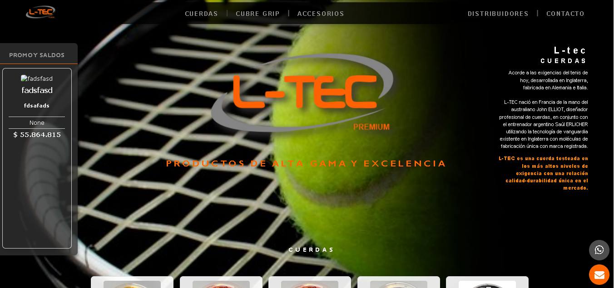
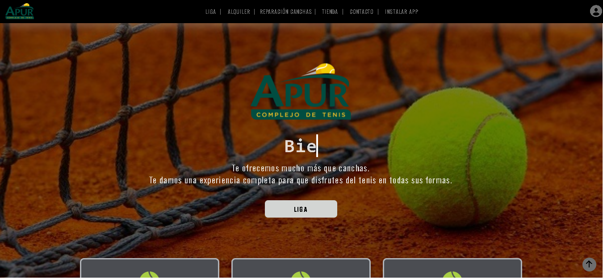
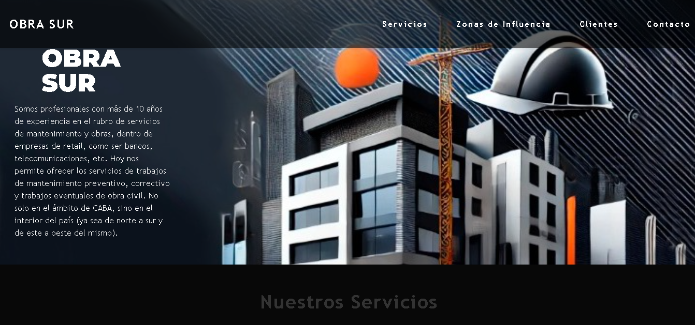

### ➤ Sobre mi
"Soy Diseñadora Gráfica - UX/UI y Full Stack Developer. Apasionada por los desafíos y el aprendizaje constante, disfruto trabajar en equipo para alcanzar objetivos comunes y superar expectativas. Siempre busco crecer y aportar soluciones creativas en cada proyecto."

---
###  ➤ Herramientas y Lenguajes

  <!-- Frontend -->
  
  
  
  
  

  <!-- Backend -->
  
  
  

  <!-- Diseño -->
  
  
  

  <!-- Control de versiones -->
  
  

---
###  ➤ Proyectos    

➔ L-tec Premium - 2025  
Sitio Web institucional de cuerdas y cubre grip de tenis. Rediseño y estructuración del sitio.   
[Web](https://l-tectenis.com.ar/)

 
Desarrollo:  
Rediseño y estructuración del sitio.  
[Repo](https://github.com/CAROLLFLORES/Ltec.git)   
 
Desarrollo:  
Para administrador para modificar productos y precios. Django. Sqlite. Html. Css. JavaScript

._______________________________________________________________________.

➔ Apur Tenis - 2025  
Sistema de gestión de Torneos y Sitio Web institucional de complejo de tenis, dentro de sistema de gestión.  
Objetivo del sistema:  
Gestionar torneos de tenis, jugadores, categorías, ascensos/descensos, ranking e historiales de manera ordenada y eficiente. 
El proyecto incluye todo el proceso: **análisis, diseño, desarrollo, pruebas y despliegue**.  
[Web](https://complejodetenisapur.com.ar/) | [Video](https://www.youtube.com/watch?v=Vy9oJG1urvw)

 
Presentacion_Web_Liga_Apur.mp4

Desarrollo:  
 Modelo de datos. Wireframes:. Wireflows. Python. Django. Json. JavaScript. Css. SQLite. Django ORM. Git / GitHub.

._______________________________________________________________________.

➔ Obra SUr - 2023  
Sitio Web institucional de empresa constructora.   

 
Desarrollo:  
Html. JS. Css. Bootstrap

---
###  ➤Contacto    

   

<!--
**CAROLLFLORES/CAROLLFLORES** is a ✨ _special_ ✨ repository because its `README.md` (this file) appears on your GitHub profile.

Here are some ideas to get you started:

- 🔭 I’m currently working on ...
- 🌱 I’m currently learning ...
- 👯 I’m looking to collaborate on ...
- 🤔 I’m looking for help with ...
- 💬 Ask me about ...
- 📫 How to reach me: ...
- 😄 Pronouns: ...
- ⚡ Fun fact: ...
-->
